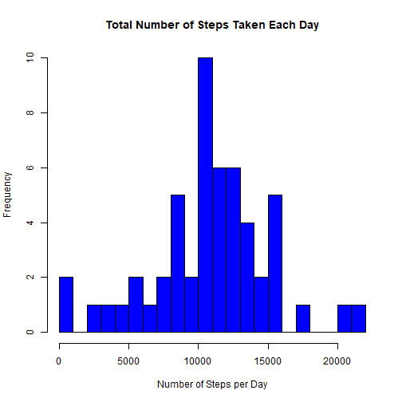
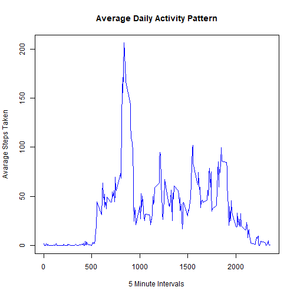
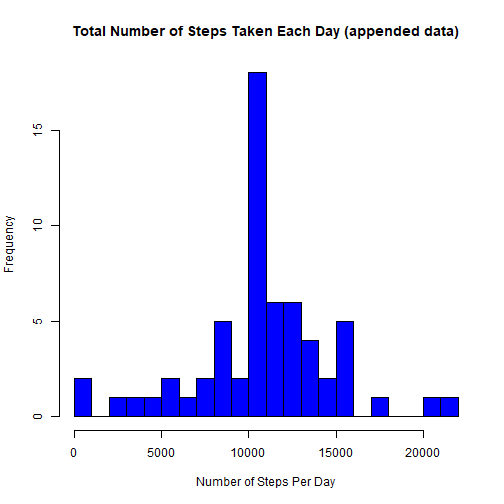
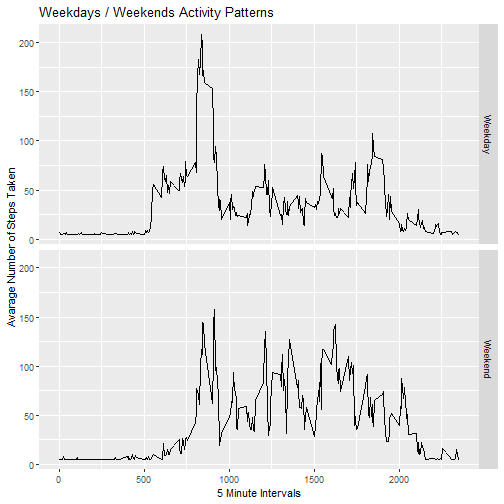

## Purpose.

The Purpose of this assignment is to analyze data from a personal activity device.  This device, which is worn by an individual, collects data on a 5-minute interval throughout the day.  The data consists of 2 months of data from an anonymous individual collected during the months of October and November, 2012 and includes the number of steps taken in 5 minute intervals each day.

## The Data.
The variables included in this dataset are:

steps: Number of steps taken in a 5-minute interval (missing values are coded as NA)<br />
date: The date on which the measurement was taken in YYYY-MM-DD format<br />
interval: Identifier for the 5-minute interval in which measurement was taken

The dataset is stored in a comma-separated-value (CSV) file and there are a total of 17,568 observations in this dataset.

The dataset may be downloaded from this location:<br />
https://d396qusza40orc.cloudfront.net/repdata%2Fdata%2Factivity.zip

## Task 1 - Loading and Pre-processing the Data.
The dataset has already been loaded into the working directory. Set the working directory, load the data, assign variables for the raw and post-processed data (removing NA's). 

Step 1: Load the data
Step 2: Process/transform the data (if necessary) into a format suitable for your analysis (Remove NA's)

```r
setwd("D:/R Programming")
raw_data <- read.csv("activity.csv", header = TRUE)
post_data <- na.omit(raw_data)
```

Some preliminary exploration of the data:

```r
summary(raw_data)
```

```
##      steps            date              interval     
##  Min.   :  0.00   Length:17568       Min.   :   0.0  
##  1st Qu.:  0.00   Class :character   1st Qu.: 588.8  
##  Median :  0.00   Mode  :character   Median :1177.5  
##  Mean   : 37.38                      Mean   :1177.5  
##  3rd Qu.: 12.00                      3rd Qu.:1766.2  
##  Max.   :806.00                      Max.   :2355.0  
##  NA's   :2304
```

```r
str(raw_data)
```

```
## 'data.frame':	17568 obs. of  3 variables:
##  $ steps   : int  NA NA NA NA NA NA NA NA NA NA ...
##  $ date    : chr  "2012-10-01" "2012-10-01" "2012-10-01" "2012-10-01" ...
##  $ interval: int  0 5 10 15 20 25 30 35 40 45 ...
```

```r
head(raw_data)
```

```
##   steps       date interval
## 1    NA 2012-10-01        0
## 2    NA 2012-10-01        5
## 3    NA 2012-10-01       10
## 4    NA 2012-10-01       15
## 5    NA 2012-10-01       20
## 6    NA 2012-10-01       25
```

## Task 2 - What is mean total number of steps taken per day?

Step 1:  Using the aggregate function, calculate the total number of steps per day using a data frame with 2 columns DAY and SUM.


```r
steps_per_day <- aggregate(post_data$steps, by = list(Steps.Date = post_data$date), FUN = "sum")
```

Step 2:  Plot a histogram depicting the frequency distribution of total steps taken by day.



Step 3:Calculate and report the mean and median of the total number of steps taken per day.

Now calculate and print the MEAN: 

```r
mean_steps <- mean(steps_per_day[,2])
print(mean_steps)
```

```
## [1] 10766.19
```

Now calculate and print the MEDIAN.

```r
median_steps <- median(steps_per_day[,2])
print(median_steps)
```

```
## [1] 10765
```

## Task 3 - What is the average daily activity pattern?

Step 1: Below is a time series plot of the 5-minute interval (x-axis) and the average number of steps taken, averaged across all days (y-axis).



Step 2:  Which 5-minute interval, on average across all the days in the dataset, contains the maximum number of steps?


```r
interval_row <- which.max(avarage_day$x)
max_interval <- avarage_day[interval_row,1]
print (max_interval)
```

```
## [1] 835
```

## Task 4 - Inputing missing values.
There are a number of days/intervals where there are missing values (coded as NA). The presence of missing days may introduce bias into some calculations or summaries of the data.

Step 1:  Calculate and report the total number of missing values in the dataset (i.e. the total number of rows with NAs) <br />


```r
NA_count <- length(which(is.na(raw_data$steps)))
print (NA_count)
```

```
## [1] 2304
```

Step 2:  This step fills in all of the missing values in the dataset. This step uses the 'impute' function in the "Hmisc" package - it is assumed this package has already been installed in r.  <br />

Step 3:  Create a new dataset that is equal to the original dataset but with the missing data filled in.<br />


```r
raw_data_append <- raw_data
raw_data_append$steps <- impute(raw_data$steps, fun=mean)
```

Step 4:  Make a histogram of the total number of steps taken each day. and Calculate and report the MEAN and MEDIAN total number of steps taken per day. 



The calculated MEAN:

```r
mean_steps_no_NA <- mean(steps_per_day_no_NA[,2])
print (mean_steps_no_NA)
```

```
## [1] 10766.19
```

The calculated MEDIAN:

```r
median_steps_no_NA <- median(steps_per_day_no_NA[,2])
print (median_steps_no_NA)
```

```
## [1] 10766.19
```

Do these values differ from the estimates from the first part of the assignment?<br /> The MEAN is the same; however, the MEDIAN is different.

What is the impact of imputing missing data on the estimates of the total daily number of steps?<br />  The values substituted for the NA values is the MEAN of all of the other values, so the adjusted MEAN wwill be the same as the original MEAN, i.e. it will not change (having no effect on the MEAN); however, the MEDIAN changes as by definition the MEDIAN is the middle number in a set of values when those values are arranged from smallest to largest.  The substituted values case a re-order of the values.

## Task 5 - Are there differences in activity patterns between weekdays and weekends?

Step 1: Create a new factor variable in the dataset with two levels – “weekday” and “weekend” indicating whether a given date is a weekday or weekend day.<br />
 

```r
raw_data_append$date <- as.Date(raw_data_append$date)
raw_data_append$weekday <- weekdays(raw_data_append$date)
raw_data_append$day_type <- ifelse(raw_data_append$weekday=="Saturday" |                                         raw_data_append$weekday=="Sunday","Weekend","Weekday")
raw_data_append$day_type <- factor(raw_data_append$day_type)
```

Step 2: Below is a panel plot containing a time series plot of the 5-minute interval (x-axis) and the average number of steps taken, averaged across all weekday days or weekend days (y-axis). 
 

```r
day_types_set <- aggregate(steps ~ interval + day_type, data=raw_data_append, mean)

library(ggplot2)
ggplot(day_types_set, aes(interval, steps)) + 
        geom_line() + 
        facet_grid(day_type ~ .) +
        xlab("5 Minute Intervals") + 
        ylab("Avarage Number of Steps Taken") +
        ggtitle("Weekdays / Weekends Activity Patterns")
```



There ARE differences in acitvity patterns between weekdays and weekends as measured by the personal activity device.  The data shows that the number of steps on weekends is higher on average during the day, but the peak in the morning is higher on weekdays.
